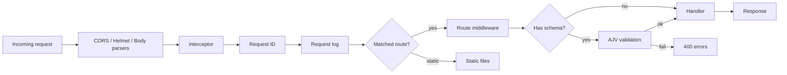

# xpref

Express.js application bootstrap for APIs — nested routing, request validation, OpenAPI docs, idempotency, proxying, and i18n.

## Features

| Area | Capabilities |
| --- | --- |
| **Server** | Express 5 bootstrap, port fallback, `onInit` / `interceptor` hooks, startup banner |
| **Security** | Helmet, CORS, trust proxy, JSON / URL-encoded body parsing (8MB) |
| **Routing** | Nested route trees, per-route middleware, static file serving |
| **Validation** | AJV schemas for query, path, and body with readable 400 errors |
| **Observability** | Request IDs, Morgan access logs, optional external logger |
| **Modules** | OpenAPI / Swagger, idempotency, request forwarder, i18n |

## Installation

```bash
npm install xpref
```

## Request flow

Every request passes through the same pipeline:

```text
┌─────────────────────────────────────────────────────────────┐
│                         xpref()                             │
├─────────────────────────────────────────────────────────────┤
│  1. onInit(app)              optional early hook            │
│  2. Built-in middleware      cors → helmet → json → urlenc  │
│  3. interceptor(app)         optional custom middleware     │
│  4. Request ID               Request-Id on request/response │
│  5. Request logging          Morgan (+ optional logger)     │
│  6. Static routes            staticRoutes mounts            │
│  7. Route tree               middleware → validate → action │
└─────────────────────────────────────────────────────────────┘
```



## Quick start

```typescript
import xpref from 'xpref';

xpref({
  appName: 'my-app',
  appEnv: 'development',
  port: 3000,
  routes: {
    '/api/health': [
      'health',
      [],
      {
        get: (_req, res) => res.json({ status: 'ok' }),
      },
    ],
  },
}).then(({ port }) => {
  console.log(`Listening on ${port}`);
});
```

Returns `{ port, app }`. If the port is in use, xpref retries the next available port.

---

## How to use

### Route shape

Each path is a tuple: `[name, middleware[], handlers, children?]`.

```typescript
type PathDetail = [
  string,                          // route name (for docs / logging)
  any[],                           // middleware
  MethodHandler,                   // get | post | put | delete | patch
  Record<string, PathDetail>?,     // nested children
];
```

### Nested routes and middleware

```typescript
xpref({
  appName: 'my-app',
  appEnv: 'development',
  port: 3000,
  interceptor: (app) => {
    app.use((req, _res, next) => {
      console.log(req.method, req.url);
      next();
    });
  },
  routes: {
    '/api/users': [
      'users',
      [],
      {
        get: (req, res) => res.json({ users: [] }),
        post: (req, res) => res.status(201).json(req.body),
      },
      {
        '/:id': [
          'user-by-id',
          [authMiddleware],
          {
            get: (req, res) => res.json({ id: req.params.id }),
            put: (req, res) => res.json({ updated: true }),
            delete: (req, res) => res.status(204).end(),
          },
        ],
      },
    ],
  },
});
```

### Request validation

Define shared schemas once, then reference them on method handlers:

```typescript
xpref({
  appName: 'my-app',
  appEnv: 'development',
  port: 3000,
  schemas: {
    email: { type: 'string', format: 'email' },
    name: { type: 'string', minLength: 1 },
  },
  routes: {
    '/api/users': [
      'users',
      [],
      {
        post: {
          description: 'Create a user',
          params: {
            body: {
              type: 'object',
              properties: ['email', 'name'],
              required: ['email', 'name'],
            },
          },
          action: (req, res) => {
            res.status(201).json(req.body);
          },
        },
      },
    ],
  },
});
```

Handlers can be a function, an array of functions, or `{ action, params, description }`.

### Static files

```typescript
xpref({
  appName: 'my-app',
  appEnv: 'development',
  port: 3000,
  staticRoutes: {
    '/public': './public',
    '/uploads': './uploads',
  },
  routes: { /* ... */ },
});
```

### Manual start

Skip auto-listen when you need custom server control (HTTPS, clustering, tests):

```typescript
xpref({
  appName: 'my-app',
  appEnv: 'development',
  port: 3000,
  manuallyStart: ({ app, port }) =>
    new Promise((resolve) => {
      const server = app.listen(port, () => {
        resolve({ port, app, server });
      });
    }),
  routes: { /* ... */ },
});
```

### Request logging

Pass any logger compatible with your stack (for example `@core/log-client`):

```typescript
import xpref from 'xpref';
import { createLogger } from '@core/log-client';

const logger = createLogger({
  appName: 'my-app',
  appEnv: 'development',
});

xpref({
  appName: 'my-app',
  appEnv: 'development',
  port: 3000,
  logger,
  routes: { /* ... */ },
});
```

Console logs always include app name, env, request ID, method, status, URL, timing, and user-agent.

---

## Modules

### Idempotency — `xpref/idempotency`

Ensures a POST runs once for a given `idempotency-key` (UUID v4). Supports JSON and `x-www-form-urlencoded` bodies.

| Option | Default | Description |
| --- | --- | --- |
| `ttl` | `300` | Cache lifetime in seconds |
| `enforced` | `false` | Require the header on the route |
| `headerKey` | `idempotency-key` | Header name |
| `validateResponse` | status 200/201 | Custom success check |

```typescript
import type { Route } from 'xpref';
import idempotency from 'xpref/idempotency';

const routes = {
  '/wallets': [
    'wallets',
    [],
    {},
    {
      '/transfer': [
        'transfer',
        [idempotency({ enforced: true, ttl: 300 })],
        { post: walletTransferAction },
      ],
    },
  ],
} as Route;
```

**Client guidance:** retry on `5xx`, `422`, `429` (and similar) with exponential backoff. In-progress requests return `202`; expired keys return `410`.

### OpenAPI / Swagger — `xpref/api-docs`

Generates an OpenAPI 3.0 document from routes and schemas, then mounts Swagger UI.

```typescript
import setupApiDocs from 'xpref/api-docs';

const [serve, setup] = setupApiDocs(
  {
    info: {
      title: 'My API',
      version: '1.0.0',
      description: 'API documentation',
    },
    bearerAuth: true,
    apiKeys: ['x-api-key'],
    tags: {
      users: { description: 'User endpoints' },
    },
  },
  { routes, schemas },
);

app.use('/docs', serve, setup);
```

### Request forwarder — `xpref/request-forwarder`

Proxy or stream requests to an upstream service.

```typescript
import { forwarder, proxy } from 'xpref/request-forwarder';

// Forward and respond from upstream
app.use('/upstream', forwarder({
  host: 'https://api.example.com',
  proxyPrefix: '/v1',
  headers: { 'x-api-key': 'secret' },
}));

// Collect upstream result, then continue the chain
app.use(
  '/gateway',
  forwarder({ host: 'https://api.example.com', passToNext: true }),
  (req, res) => {
    res.json({ ok: true });
  },
);

// Stream pipe
app.use('/proxy', proxy({
  host: 'https://api.example.com',
  withPrefix: true,
  onUrlConstructed: (url) => url.replace(/\/+$/, ''),
}));
```

### i18n — `xpref`

```typescript
import { i18n } from 'xpref';

const t = i18n({
  locale: {
    en: './locales/en.json',
    km: './locales/km.json',
  },
  fallbackLang: 'en',
});

t('welcome.message', { name: 'Ada' }, 'en');
// Locale strings use {placeholder} substitution
```

---

## API reference

### `xpref(props): Promise<{ port: number; app: Application }>`

| Option | Type | Description |
| --- | --- | --- |
| `appName` | `string` | Application name |
| `appEnv` | `string` | Environment (`development`, `production`, …) |
| `port` | `number` | Listen port (default `3000`; auto-increments if busy) |
| `routes` | `Route` | Nested route configuration |
| `schemas` | `Record<string, any>` | Shared AJV schemas |
| `staticRoutes` | `Record<string, string>` | URL path → filesystem path |
| `logger` | `any` | Optional logger used by request logging |
| `onInit` | `(app) => void` | Runs before built-in middleware |
| `interceptor` | `(app) => void` | Runs after built-in middleware, before routes |
| `manuallyStart` | `({ app, port }) => Promise` | Custom listen instead of auto-start |

### Exports

| Export | Package | Description |
| --- | --- | --- |
| `xpref` (default) | `xpref` | Create and start the app |
| `getRequestId` | `xpref` | Read the current request ID |
| `i18n` | `xpref` | Initialize translations |
| Express types / `urlencoded` | `xpref` | Re-exported for convenience |
| `idempotency` | `xpref/idempotency` | Idempotency middleware |
| `setupApiDocs` | `xpref/api-docs` | OpenAPI + Swagger UI |
| `forwarder`, `proxy` | `xpref/request-forwarder` | Upstream proxy helpers |

---

## Example layout

```text
src/
├── routes/
│   ├── users.ts
│   └── auth.ts
├── middleware/
│   └── auth.ts
├── locales/
│   └── en.json
├── static/
│   └── public/
└── index.ts
```

```typescript
// src/index.ts
import xpref from 'xpref';
import { createLogger } from '@core/log-client';
import userRoutes from './routes/users';
import authRoutes from './routes/auth';
import authMiddleware from './middleware/auth';

xpref({
  appName: 'my-api',
  appEnv: process.env.NODE_ENV || 'development',
  port: Number(process.env.PORT) || 3000,
  logger: createLogger({
    appName: 'my-api',
    appEnv: process.env.NODE_ENV || 'development',
  }),
  staticRoutes: {
    '/public': './static/public',
  },
  interceptor: (app) => {
    app.use('/api/protected', authMiddleware);
  },
  routes: {
    ...userRoutes,
    ...authRoutes,
  },
}).then(({ port }) => {
  console.log(`Server running on port ${port}`);
});
```

## License

ISC
